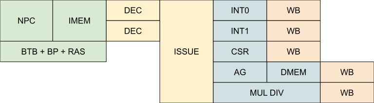

# RISu64

RISu64 (Reduced Instruction Set μProcessor 64 / Squirrel 64) is my toy 64-bit RISC-V compatible processor.

## Features

- RV64IMZicsr_Zifencei
- 7-stage pipeline: PCGen(F1), IMem(F2), Decode(ID), Issue(IX), Execute(EX), DMem(MEM), Writeback(WB).
- In-order issue and out-of-order writeback
- Single issue for now
- BTB + Bimodal/Gselect/Gshare + RAS branch predictors
- 1x Integer (arithmetic, barrel shifter, branch)
- 1x Load store unit (aligned access only, unaligned access generate precise exception)
- 1x Multiply/ divide unit (non-pipelined, 3/6-cycle 32/64bit multiply, 34/66-cycle 64bit divide)
- Optional L1 instruction and data cache
- Machine mode only with exception and interrupt support
- Written in portable synthesizable Verilog

## Performance

The performance varies based on configurations:

- 4-stage + TCM: 2.90 Coremark/MHz
- 7-stage + TCM: 2.65 Coremark/MHz
- 7-stage + 16KB 2-way set-associative I/D cache: 2.61 Coremark/MHz

The 4-stage configuration is IF ID EX WB, mostly to reduce load-to-use latency and reduce branch mis-prediction penalty. In return, the Fmax may reduce by >50% depending on the memory used.

The pipeline could be further configured to have 9-stages: F1 F2 F3 ID IX EX M1 M2 WB, in case I/D cache or data memory data arrival becomes the critical path.

The core currently only track up to 2 in-flight load/ store without stalling the core, due to the lack of a proper load-store queue and the lack of a scalable dependency check mechanism. This may change in the future.

## Status

This project is still under active development, things may break at anytime (or already broken). The features listed above are already in place and at least working to some degree.

Here is just a random list of things I want to / is working on that may or may not coming to this core:

- Compressed instruction support
- Branch predictor improvement
- FPU support
- Dual-issue
- FGMT/ SMT
- Non-blocking L2 cache
- SMP and cache-coherency
- Maybe MMU
- Rewrite in BSV

## Acknowledgements

During the design of this processor, I have used the following projects as reference:

- [lowRISC's muntjac](https://github.com/lowRISC/muntjac), Apache 2.0 license
- [UltraEmbedded's biriscv](https://github.com/ultraembedded/biriscv), Apache 2.0 license

The following third-party code have been used:

- [Gary Guo's round robin arbiter](https://garyguo.net/), BSD license

## License

MIT
